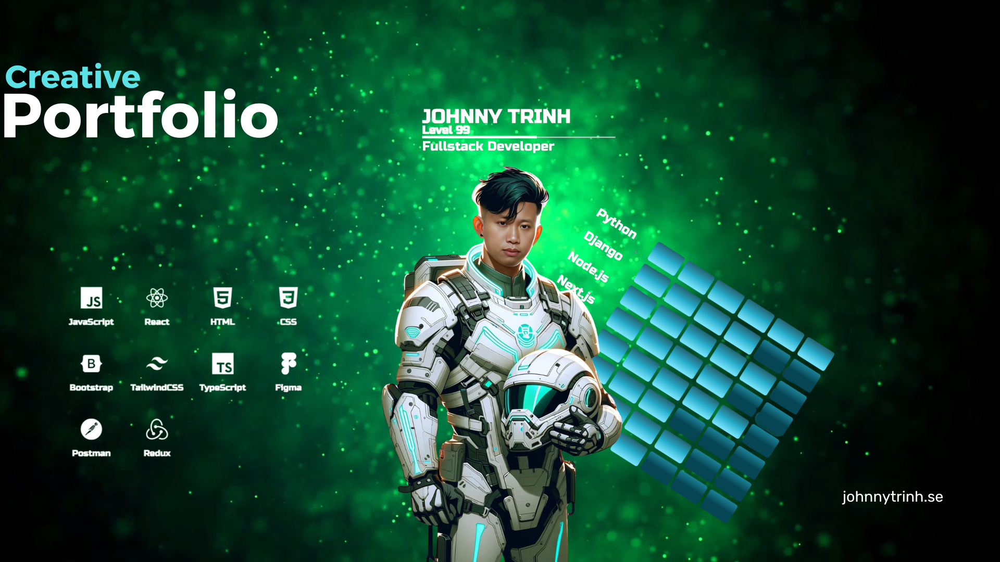
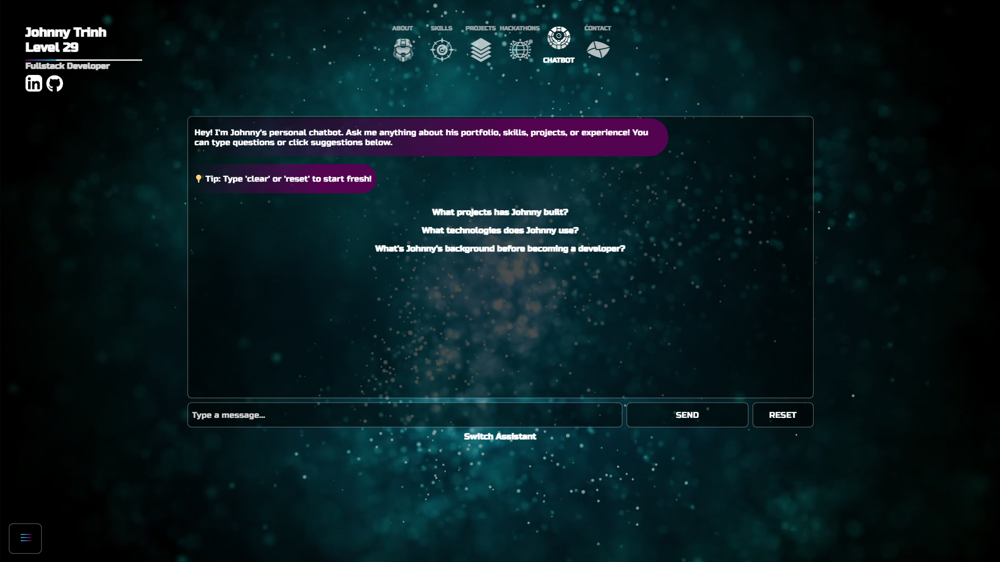
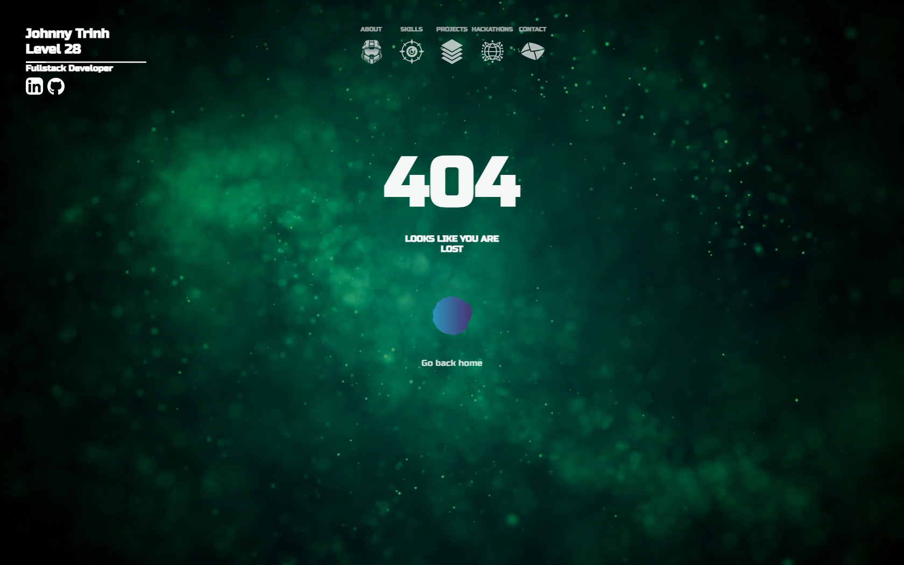

# [Johnny Trinh - Full-Stack Developer Portfolio](https://johnnytrinh.se)



This portfolio showcases my skills and experience as a full-stack developer, blending a visually engaging design with a focus on accessibility and modern web development techniques. The theme draws inspiration from the Halo universe, creating a unique and memorable user experience.

## What’s new in v3

- AI Agent on site: Chat assistant powered by the OpenAI API. Runs through a secure serverless route.
- Serverless API: api/chat with a system prompt built from shared data.
- Single source of truth: shared/profile.json feeds the assistant with projects, skills, and hackathons.
- Stronger structure: Clear split between frontend and backend. Cleaner imports. Easier to evolve.
- Consistent Markdown links: The server formats links so they render as clickable in the UI.

V2 README.md [README.md](/documentation/README-v2.md) file.

> [!NOTE]  
> V1 README.md [README.md](/documentation/README-v1.md) file.
### Stats

[](https://github.com/JohnnySonTrinh/react-portfolio/commits/main)
[](https://github.com/JohnnySonTrinh/react-portfolio/commits/main)
[](https://github.com/JohnnySonTrinh/react-portfolio)

## Key Features

- **Vapi.ai:** Voice interaction with Vapi.ai (mic in, audio out)
- **AI chat assistant:** On-site agent that knows the portfolio content and routes questions back to relevant sections.
- **AI-Generated Art Assets:** Leveraging DALL-E, Midjourney, and Picsi.AI, I created custom avatars and visual elements, enhancing the portfolio's aesthetic appeal.
- **Responsive Design:** Built with CSS3 and designed for optimal viewing across various devices and screen sizes.
- **React.js Framework:** Developed using React.js, utilizing functional components and hooks for efficient and maintainable code.
- **Smooth Navigation:** Intuitive navigation employing smooth scrolling, keyboard navigation (Tab, Shift+Tab, Enter), and mouse wheel support for seamless transitions between sections.
- **Accessibility:** Prioritized accessibility with careful consideration of ARIA attributes and keyboard navigation for all users.
- **Interactive Elements:** Engaging animations and interactive elements enhance the overall user experience.
- **Dynamic Meta Titles:** SEO-optimized, dynamic meta titles update for each page.
- **Contact Form:** A secure contact form powered by EmailJS allows for quick and easy communication.
- **Custom Hooks:** Reusable custom hooks centralize and streamline common logic for improved code maintainability.
- **Creative 404 Page:** A unique and engaging 404 page adds a touch of personality and guides users back to the main site.

## Core stack (v3)

- React for the UI
- JavaScript for app logic
- OpenAI API for the agent
- Vercel for hosting and serverless routes

> [!NOTE] 
> Supporting tools: Vapi.ai Web, React Router, React Markdown, React Helmet, classnames, DOMPurify, Web Vitals, Testing Library.

## Project Structure

The project follows a well-organized structure, promoting maintainability and scalability:

```
├── .gitignore
├── README.md
├── api
    ├── chat.js
    └── systemMessage.js
├── documentation
    ├── README-v1.md
    ├── README-v2.md
    └── readme
    │   ├── mockup.png
    │   ├── new-about.png
    │   ├── new-contact.png
    │   ├── new-hackathons.png
    │   ├── new-notfound.png
    │   ├── new-projects.png
    │   ├── new-skills.png
    │   ├── old-about.png
    │   ├── old-contact.png
    │   ├── old-hackathons.png
    │   ├── old-projects.png
    │   └── old-skills.png
├── package-lock.json
├── package.json
├── public
    ├── favicon.ico
    ├── index.html
    └── robots.txt
├── shared
    └── profile.json
├── src
    ├── App.js
    ├── api
    │   └── assistantClient.js
    ├── assets
    │   ├── astronaut-helmet.png
    │   ├── avatar-image.png
    │   ├── avatar-image.webp
    │   ├── background-transition.mp4
    │   ├── bg-universe.mp4
    │   ├── dead-eye.png
    │   ├── eagle-emblem.png
    │   ├── envelope.png
    │   ├── fallback-image.webp
    │   ├── github.png
    │   ├── global.png
    │   ├── hawk-emblem.png
    │   ├── linkedin.png
    │   ├── moebius-triangle.png
    │   ├── robot-bot.png
    │   ├── stack.png
    │   ├── the-uprising.mp3
    │   ├── triple-corn.png
    │   └── upgrade.png
    ├── components
    │   ├── assistant
    │   │   ├── AssistantChoice.jsx
    │   │   ├── ChatAssistant.jsx
    │   │   └── VoiceAssistant.jsx
    │   ├── avatar
    │   │   └── Avatar.jsx
    │   ├── background
    │   │   └── Background.jsx
    │   ├── music
    │   │   └── MusicPlayer.jsx
    │   ├── nav
    │   │   ├── HamburgerMenu.jsx
    │   │   ├── Nav.jsx
    │   │   └── NavMenu.jsx
    │   ├── playerStats
    │   │   └── PlayerStats.jsx
    │   └── shadowOverlay
    │   │   └── ShadowOverlay.jsx
    ├── data
    │   ├── chatSuggestions.js
    │   ├── hackathonsData.js
    │   ├── navData.js
    │   ├── pageTitles.js
    │   ├── projectsData.js
    │   ├── skillsData.js
    │   ├── subheadingsData.js
    │   └── voice-data.json
    ├── hooks
    │   ├── useAbout.js
    │   ├── useActiveProject.js
    │   ├── useAvatar.js
    │   ├── useChatbot.js
    │   ├── useContactForm.js
    │   ├── useEmailGate.js
    │   ├── useMetaTitle.js
    │   ├── usePlayerStats.js
    │   ├── useSkills.js
    │   ├── useVoiceAssistant.js
    │   └── useWebGLAnimation.js
    ├── index.js
    ├── pages
    │   ├── 404page
    │   │   ├── NotFound.jsx
    │   │   └── NotFoundMenu.jsx
    │   ├── about
    │   │   ├── About.jsx
    │   │   ├── AboutMenu.jsx
    │   │   ├── AboutMenuItems.jsx
    │   │   └── AboutSubheading.jsx
    │   ├── chatbot
    │   │   ├── Chatbot.jsx
    │   │   ├── ChatbotMenu.jsx
    │   │   └── EmailGate.jsx
    │   ├── contact
    │   │   ├── Contact.jsx
    │   │   └── ContactMenu.jsx
    │   ├── hackathons
    │   │   ├── Hackathons.jsx
    │   │   └── HackathonsMenu.jsx
    │   ├── projects
    │   │   ├── Projects.jsx
    │   │   └── ProjectsMenu.jsx
    │   └── skills
    │   │   ├── Skills.jsx
    │   │   └── SkillsMenu.jsx
    ├── reportWebVitals.js
    ├── setupTests.js
    ├── styles
    │   ├── ShadowOverlay.css
    │   ├── aboutMenu.css
    │   ├── app.css
    │   ├── assistantChoice.css
    │   ├── avatar.css
    │   ├── background.css
    │   ├── chatAssistant.css
    │   ├── chatbot.css
    │   ├── contact.css
    │   ├── emailGate.css
    │   ├── nav.css
    │   ├── notFound.css
    │   ├── playerStats.css
    │   ├── projects.css
    │   ├── skillsMenu.css
    │   └── voiceAssistant.css
    └── utils
    │   ├── calculateAge.js
    │   ├── handleProjectWheel.js
    │   ├── handleWheelScroll.js
    │   └── updateMetaTitle.js
└── vercel.json
```

## Installation and Setup

1. **Clone the repository:** `git clone <repository_url>`
2. **Navigate to the project directory:** `cd react-portfolio`
3. **Install dependencies:** `npm install`
4. **Start the development server:** `npm start`

This will start the application in development mode. You can then view the portfolio in your web browser.

**Note:** You will need to set environment variables (`.env.local`) for EmailJS to function correctly. Refer to the EmailJS documentation for setup instructions.

## Features: Detailed Overview

### About/Landing Page

This section provides a concise yet compelling introduction to my background and skills. The design is clean and visually appealing, immediately engaging the visitor. The avatar features a subtle fade-in animation.


### Skills Section

The skills section uses a visually appealing skill tree metaphor, enhancing engagement and providing a unique way to present my proficiencies. Clicking on a skill category triggers a smooth transition and animation.


### Projects and Hackathons Sections

These sections showcase a selection of my projects and hackathon contributions. Each project/hackathon includes:

- A high-quality image.
- A concise description.
- A list of technologies used.
- Links to the GitHub repository and live demo (if available).

Navigation between projects/hackathons is smooth and intuitive, thanks to integrated mouse wheel scrolling and arrow buttons, providing a user-friendly experience.


### AI Chat Assistant

The AI-powered chat assistant provides an interactive way for visitors to learn about my background, skills, and projects. The assistant has knowledge of all portfolio content and can answer questions about my experience, redirect users to relevant sections, and provide detailed information about specific projects or skills.

Key features:
- Powered by OpenAI API through secure serverless routes
- Trained on portfolio content from shared/profile.json
- Supports markdown formatting for rich responses
- Can direct users to specific portfolio sections



### Voice Assistant

The voice assistant integration powered by Vapi.ai enables hands-free interaction with the portfolio. Visitors can speak naturally to ask questions about my experience, skills, and projects, receiving audio responses that provide the same intelligent assistance as the chat interface.

Key features:
- Voice-to-voice interaction (mic in, audio out)
- Powered by Vapi.ai integration
- Natural language processing for spoken queries
- Audio responses with human-like speech
- Seamless integration with portfolio knowledge base


### Contact Section

The contact section features a clean and simple form with built-in validation to ensure accuracy. The submission is handled securely via EmailJS. A success message confirms successful submission.


### 404 Page

The custom 404 page provides a memorable and engaging experience when a user encounters a broken link, using WebGL to create a dynamic, animated background, enhanced by background music that activates when the central blob is clicked.



## Contact

Connect with me on [LinkedIn](https://www.linkedin.com/in/johnny-trinh-dev/) and [GitHub](https://github.com/JohnnySonTrinh).

## Credits

I am grateful for the variety of resources and people that gave me feedback for how to improve to version 2 to the successful completion of this project!
