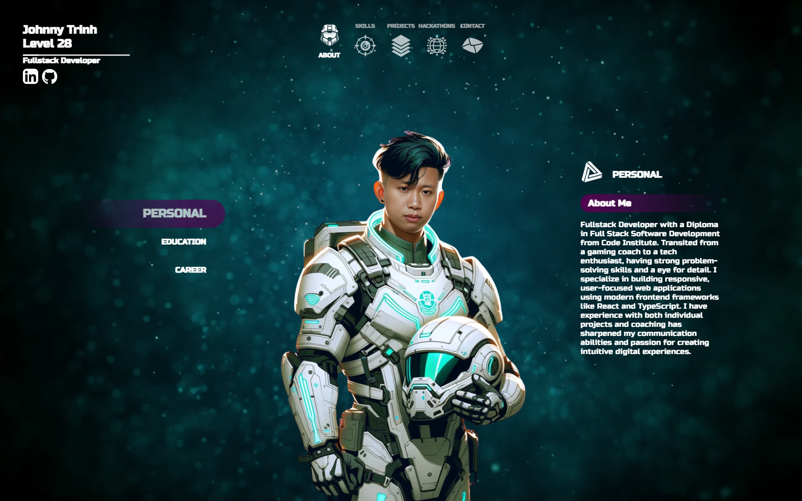
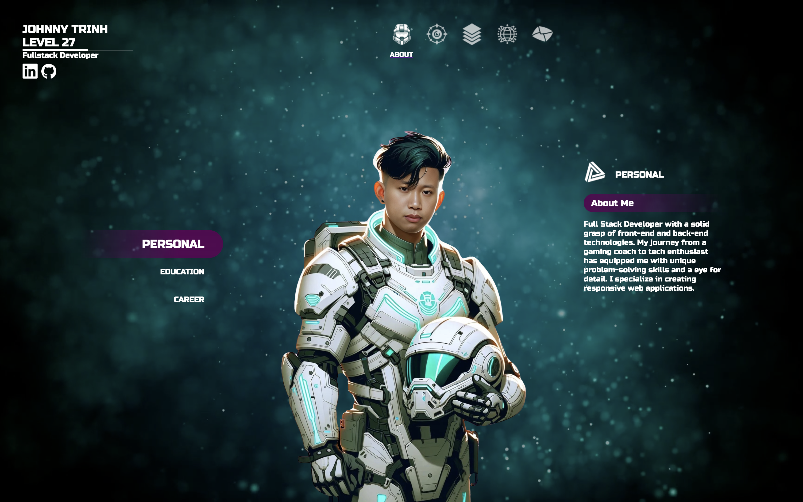
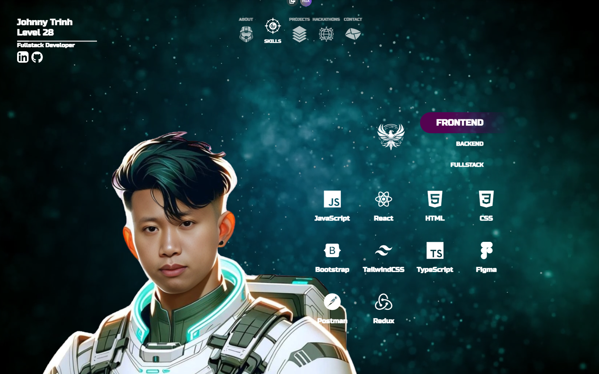
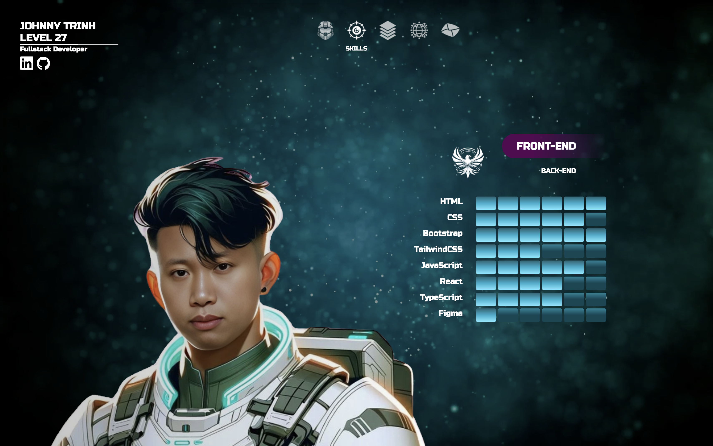
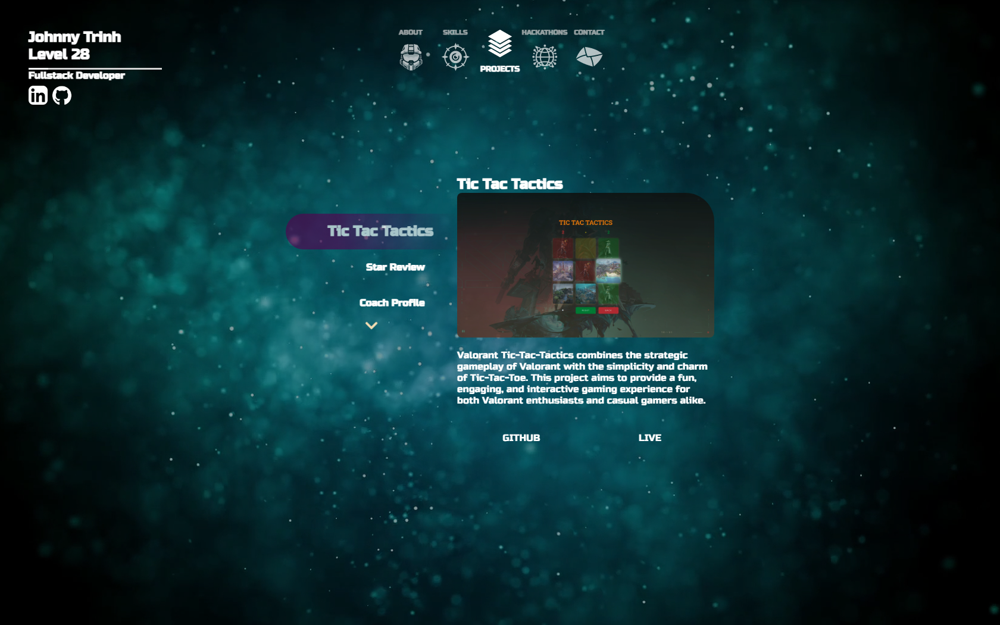
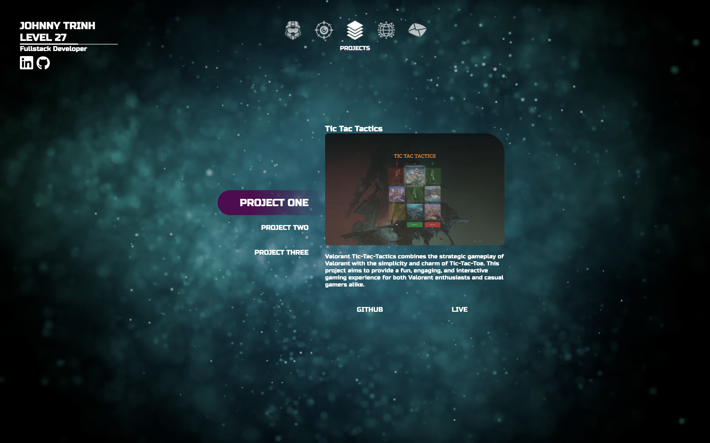
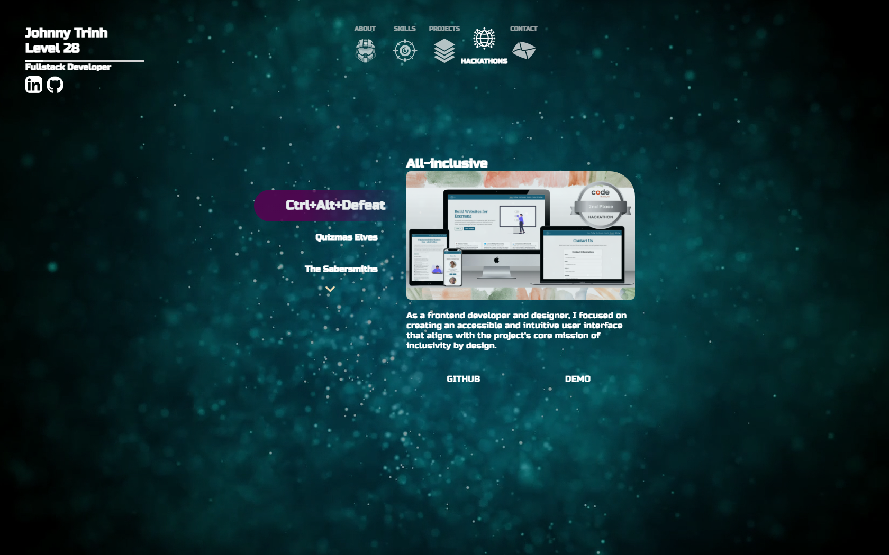
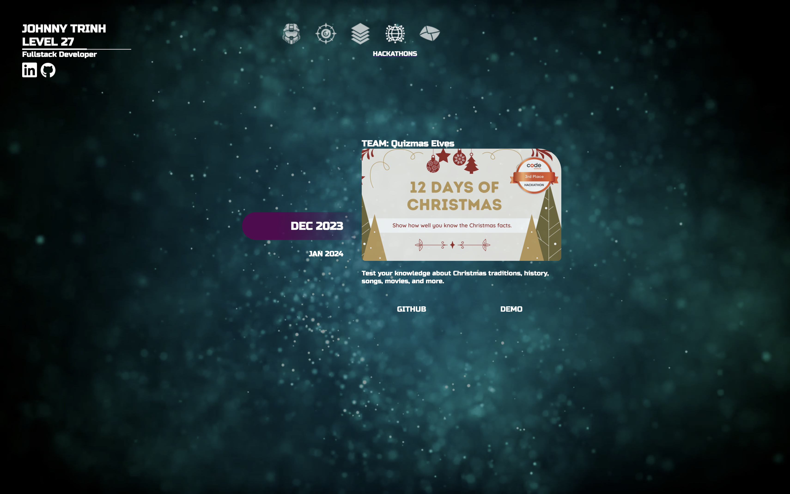
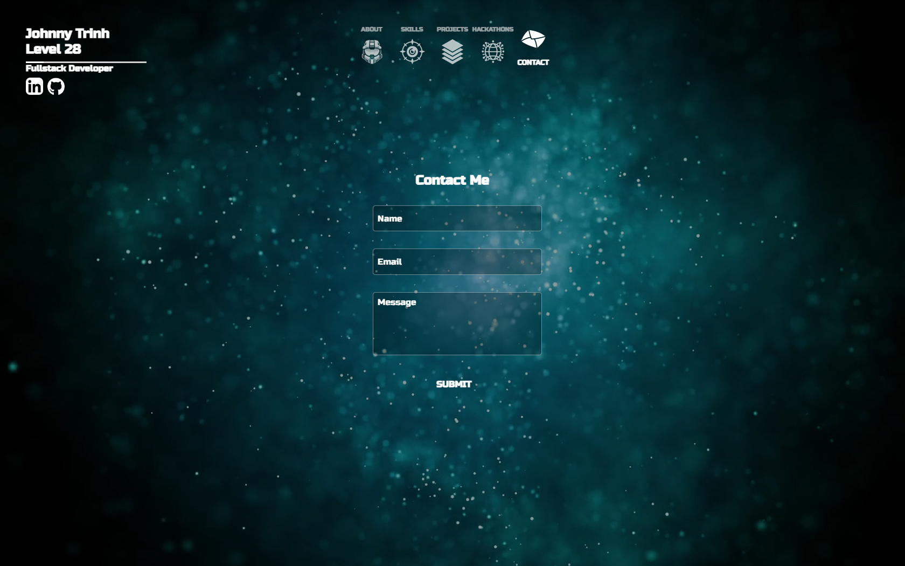
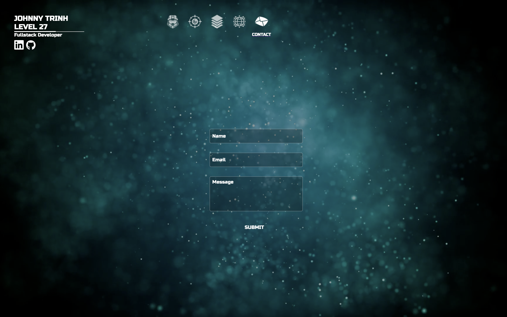

# [PORTFOLIO](https://react-portfolio-wine-six.vercel.app/)


Halo-themed portfolio built with accessibility and modern design in mind. Leveraging cutting-edge technologies, this portfolio includes:

- AI-Generated Art Assets: Created using DALL·E for stunning visuals and avatars, enhanced with Midjourney and Picsi.AI by InsightFaceSwap Bot for advanced face-swapping.
- React Functionality: Utilizing React useState hooks to manage dynamic UI elements and provide seamless interactivity.
- Keyboard Navigation: Fully accessible with Tab, Shift+Tab, and Enter keys, ensuring intuitive navigation for all users.
- Dynamic Backgrounds: Engaging and responsive background animations that elevate the user experience.
- Modern Web Design: Built with CSS3, featuring responsive layouts and sleek visual effects.
- Direct Form Submission: Secure, fully functional contact forms powered by EmailJS for instant submissions without backend complexity.

## Updates

<details>
<summary> Click here for detailed version 2 updates </summary>
-----

> [!NOTE]  
> Old README.md [README.md](README.md) file.

### All Updates

- **Re-designing Skill Tree**: Removed the skill bars and added a more up-to-date, interactive Skill Tree.
- **Enhanced Icons**: Implemented the Devicon Library to ensure sleekness and consistency in skill icons.
- **Data Overhaul**: Updated and refined all project, skill, and profile data.
- **Added Animations**: Smooth animations on all pages create a more dynamic user experience.
- **Project and Hackathon Pages**: Updated with new projects to provide evidence of contributions.
- **Code Refactor**: Improved code structure to be more readable and maintainable.
- **Performance Insights**: Integrated SpeedInsights for further detailed analysis on website performance.
- **CSS Improvements**: Updated and added CSS Root Variables to clean up the styling and make it more scalable.
- **React Functional Components**: Removed all the React classes in favor of hooks to modernize the codebase.
- **Keyboard Navigation**: Implemented full keyboard navigation by Tab, Shift+Tab, and Enter to improve accessibility.

## Updated version VS Old version

| Updates            | New version                                            | Old version                                            |
| ------------------ | ------------------------------------------------------ | ------------------------------------------------------ |
| About/Landing Page |       |       |
| Skills Page        |      |      |
| Projects Page      |    |    |
| Hackathons Page    |  |  |
| Contact Page       |     |     |
|                    |                                                        |                                                        |

</details>

### Stats

[](https://github.com/JohnnySonTrinh/react-portfolio/commits/main)
[](https://github.com/JohnnySonTrinh/react-portfolio/commits/main)
[](https://github.com/JohnnySonTrinh/react-portfolio)

## UX

```css
:root {
  --purple: #540351;
  --blue: #3627b1;
  --cyan: #25afce;
  --white: #ffffff;
  --wheat: #f5deb3;
  --grey: rgb(211, 211, 211);
  --transparent: #00000000;
  --radius-left: 3rem 0 0 3rem;
  --radius-right: 0 3rem 3rem 0;
  --font-size-large: 1.5rem;
  --font-size-medium: 1rem;
  --font-size-small: 0.8rem;
  --icon-size: 2rem;
  --icon-size-small: 1.5rem;
  --border-radius: 0.5rem;
}
```

### Typography

For the portfolio, I've chosen Russo One fonts to create "Mass effect vibe" engaging and readable user interface. The fonts were selected for their clarity and legibility.

#### Implementation in CSS

The fonts are included at the beginning of our main CSS file using the `@import` rule from Google Fonts. This method ensures that the fonts are available as soon as the CSS is loaded, maintaining a consistent typographic experience throughout portfolio.

```css
@import url("https://fonts.googleapis.com/css2?family=Russo+One&display=swap");
```

## Tools & Technologies Used

- [HTML](https://en.wikipedia.org/wiki/HTML) used for the main site content.
- [CSS](https://en.wikipedia.org/wiki/CSS) used for the main site design and layout.
- [CSS :root variables](https://www.w3schools.com/css/css3_variables.asp) used for reusable styles throughout the site.
- [JavaScript](https://www.javascript.com) used for user interaction on the site.
- [React](https://react.dev) used for web and native user interfaces
- [Git](https://git-scm.com) used for version control. (`git add`, `git commit`, `git push`)
- [GitHub](https://github.com) used for secure online code storage.
- [Vercel](https://pages.github.com) used for hosting the deployed front-end site.
- [EmailJS](https://www.emailjs.com) create a secure fully functional Direct form submission.
- [Discord](https://discord.com) used for connect face swap and create image.
- [Midjourney](https://www.midjourney.com/home?callbackUrl=%2Fexplore) used as middle-man to face swap.
- [Picsi.AI](https://www.picsi.ai) used for face swap avatar.
- [DALL·E](https://openai.com/dall-e-3) used for crate avatar and icons.
- [Devicon](https://devicon.dev) used icon for skills page

## Features

### Landing Page

The landing page presents a dynamic and visually compelling interface, designed to showcase the professional profile


### Skills

The skills are displayed in a split format, with a unique visual metaphor that borrows from the skill trees commonly found in video games, reinforcing the user's gaming background.


### Projects

Projects page is a thoughtful fusion of personal interests and professional showcase, geared towards engaging the viewer with both visual appeal and interactive elements.


### Hackathons

Maintains the cosmic theme established throughout the site, which complements the forward-thinking and innovative spirit of hackathons. It's a testament involvement in collaborative and competitive coding events.


### Contact

Contact page is a fusion of functionality and thematic design, offering a straightforward user experience without sacrificing the portfolio's overarching aesthetic.


## Credits

I am grateful for the variety of resources and people that gave me feedback for how to improve to version 2 to the successful completion of this project!
