# [Johnny Trinh - Full-Stack Developer Portfolio](https://johnnytrinh.se)

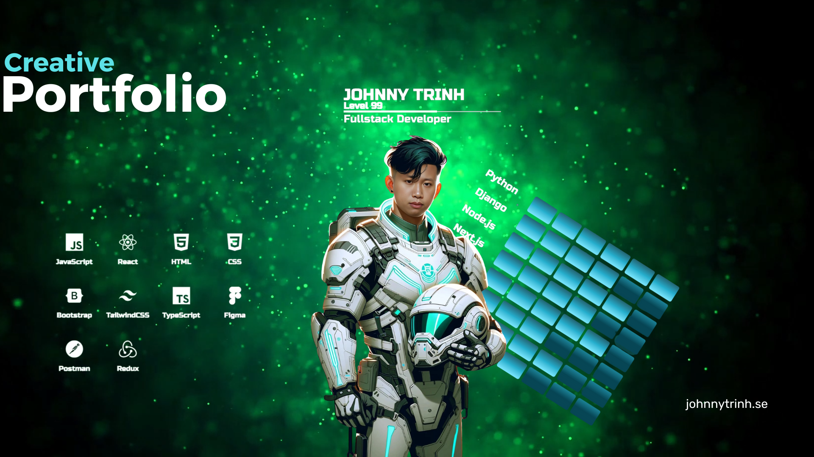

Version 3 of my portfolio is a Halo-inspired React experience built to showcase projects, skills, hackathons, and working style in a way that feels interactive rather than static. It combines a cinematic visual layer with AI-assisted exploration, voice interaction, achievement tracking, and a cleaner content architecture than the previous versions.

Previous versions:

- [README v2](documentation/README-v2.md)
- [README v1](documentation/README-v1.md)

## What's New In v3

- AI chat assistant powered by the OpenAI API through a serverless route
- Voice assistant powered by Vapi for voice-to-voice interaction
- Shared profile data model in `shared/profile.json` used across the app
- Automatic profile sync to `public/profile.json` for frontend consumption
- Achievement system with persistent progress and reset support
- New settings page with controls for background video, particles, UI motion, and the floating achievements panel
- Cleaner split between UI code, shared content, and API logic

## Highlights

- Halo-inspired visual direction with custom AI-assisted art assets
- React app with functional components, hooks, and reusable UI patterns
- Smooth keyboard, click, and wheel-based navigation
- Dynamic page titles for each route
- Secure contact form flow with EmailJS
- Chat assistant trained on portfolio-specific data instead of generic copy
- Persistent site preferences and achievement progress via `localStorage`
- Accessible labels and interactive states across key UI elements

## Feature Overview

### About

The landing page introduces my background, education, and experience through a layered menu system built for both pointer and keyboard navigation.

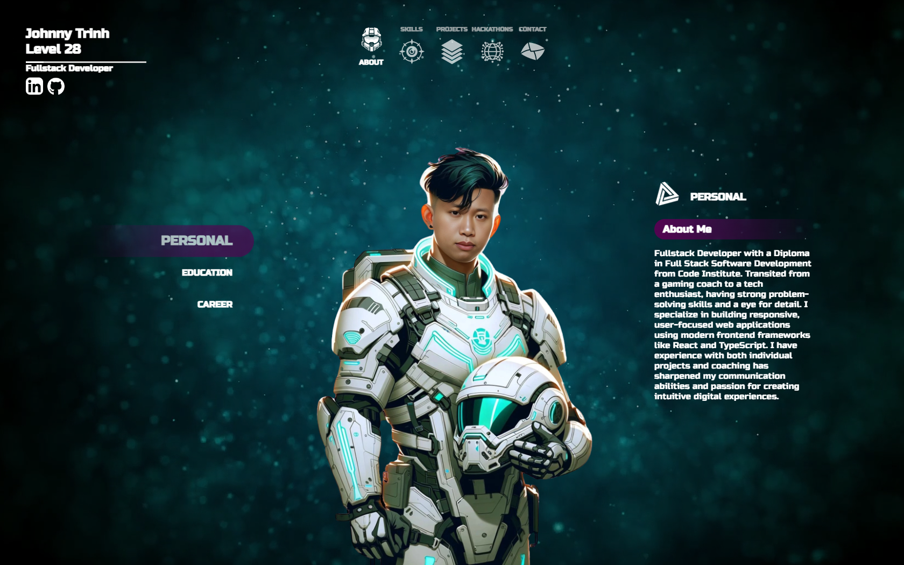

### Skills

The skills page presents frontend, backend, and fullstack tooling through a game-inspired selection flow instead of a static list.

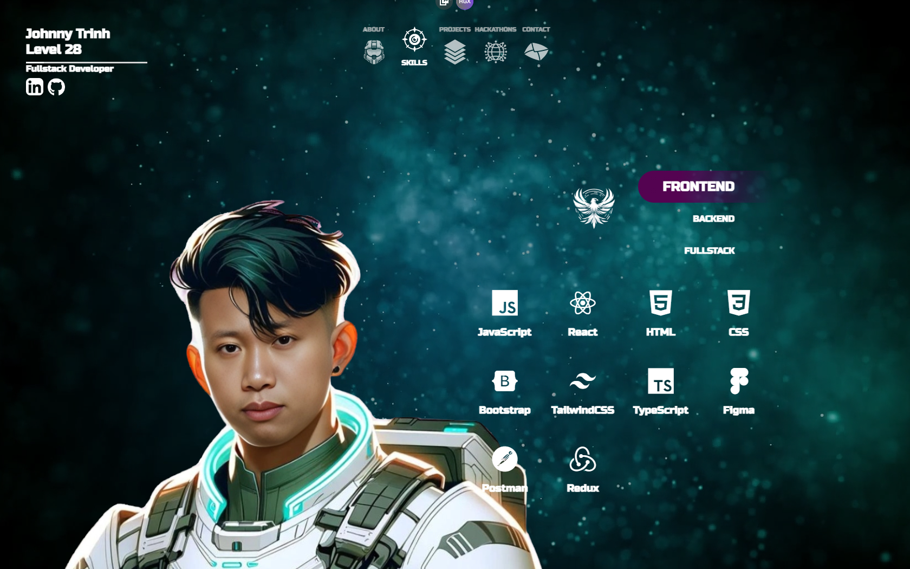

### Projects And Hackathons

Projects and hackathons use focused detail panels, wheel navigation, hover states, and quick links to source code and live demos.

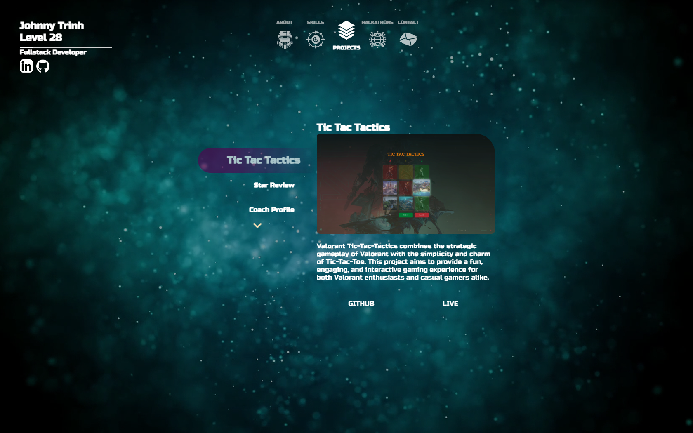
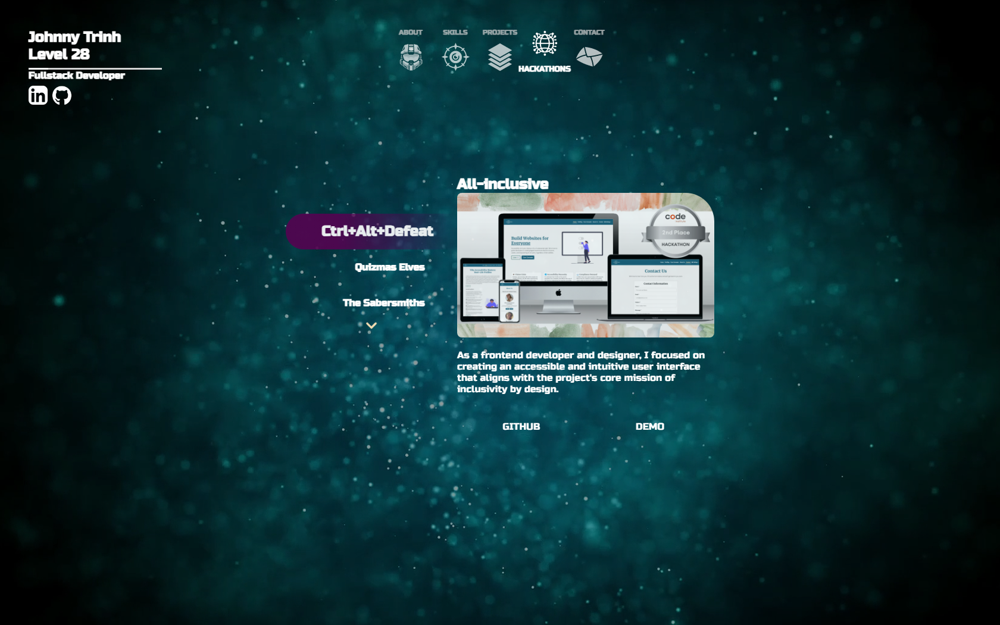

### AI Chat Assistant

The chatbot is backed by a serverless OpenAI route and a portfolio-specific system prompt built from shared data. Visitors can ask about my experience, stack, projects, and hackathons in natural language.

Key details:

- Portfolio-aware answers based on `shared/profile.json`
- Markdown-friendly replies in the UI
- Route-aware guidance to relevant sections like `/projects` and `/contact`
- Email gate before chat access

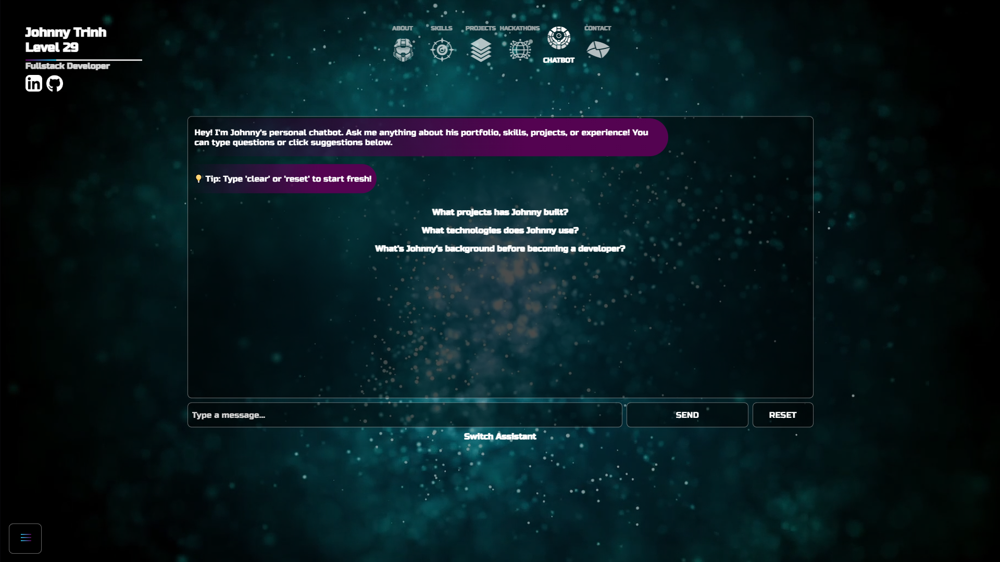

### Voice Assistant

The voice assistant uses Vapi to let visitors speak with the site instead of typing. It shares the same portfolio-focused assistant experience in a voice-first format.

### Contact

The contact page uses EmailJS with client-side validation and input sanitization to keep outreach simple and direct.

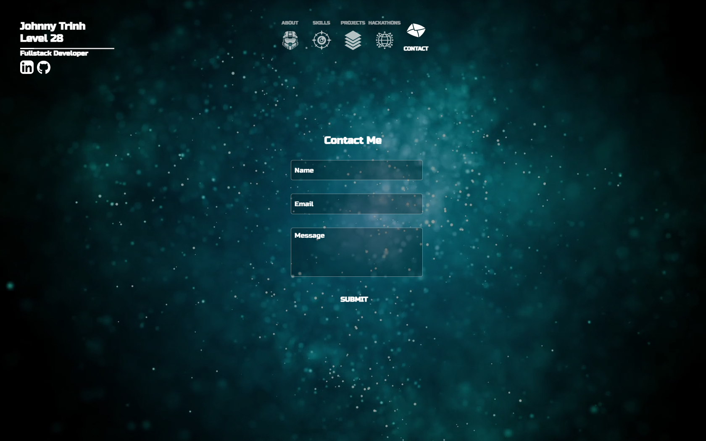

### Achievements

The portfolio includes a lightweight achievement system that rewards exploration and interaction. Progress is stored locally, surfaced in a floating panel, and can be reset from the settings page.

<p align="center">
  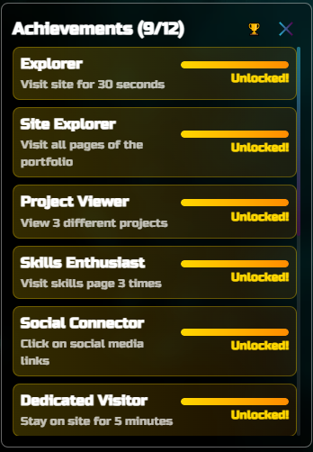
</p>

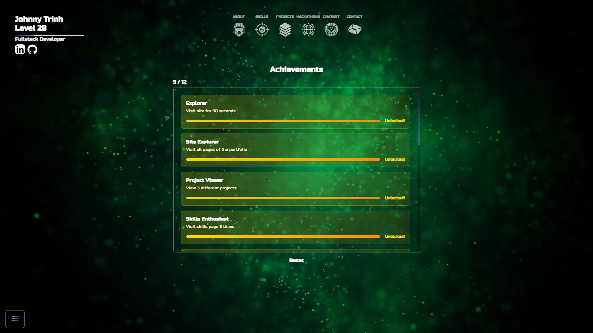

### Settings

The settings page lets visitors personalize the experience without changing the design language of the site.

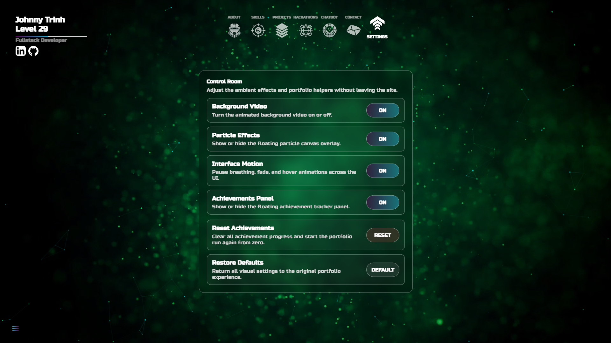

Current options:

- Toggle background video
- Toggle particle effects
- Pause UI motion
- Show or hide the floating achievements panel
- Reset achievements
- Restore default visual settings

### 404 Experience

The custom 404 page keeps the theme intact with its own animated presentation instead of dropping users into a plain fallback route.

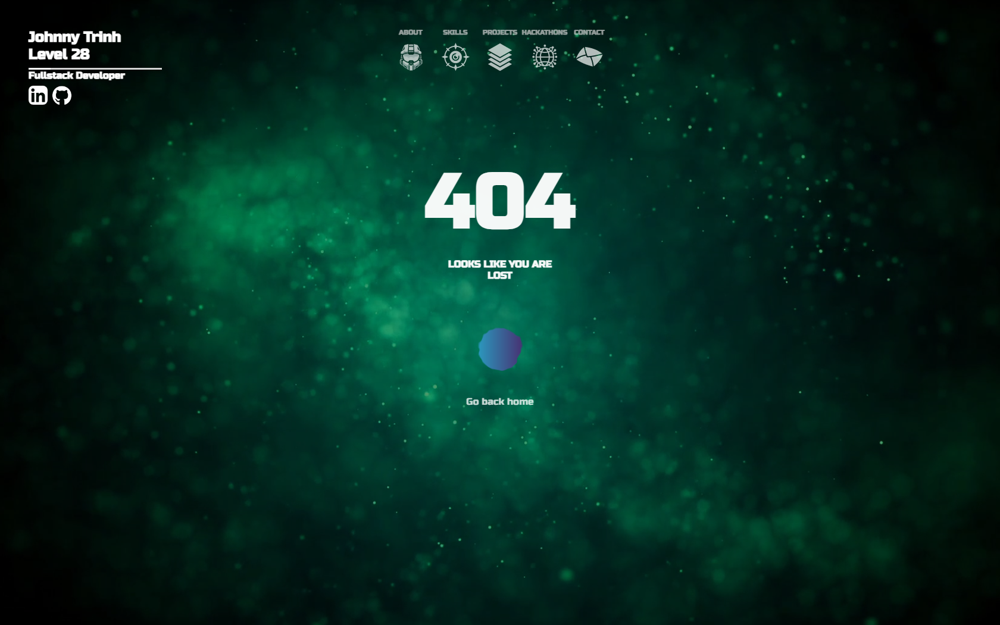

## Tech Stack

### Core

- React 18
- JavaScript
- React Router
- CSS3
- Vercel serverless functions

### Integrations

- OpenAI API
- Vapi Web SDK
- EmailJS
- React Markdown
- DOMPurify
- Devicon
- Vercel Speed Insights

## Architecture

The project is organized around a small set of responsibilities:

- `src/` contains the React application, pages, hooks, components, and styles
- `api/` contains serverless routes and prompt-building logic
- `shared/profile.json` is the main source of truth for portfolio content
- `public/profile.json` is generated automatically from the shared profile for frontend reads
- `documentation/` stores earlier READMEs and project images

### Content Flow

`shared/profile.json` -> `scripts/sync-profile.js` -> `public/profile.json` -> frontend UI

`shared/profile.json` -> `api/systemMessage.js` -> `api/chat.js` -> chatbot responses

## Project Structure

```text
├── public/
│   ├── favicon.ico
│   ├── robots.txt
│   └── index.html
├── src/
│   ├── assets/
│   │   ├── github.png
│   │   ├── global.png
│   │   ├── stack.png
│   │   ├── dead-eye.png
│   │   ├── envelope.png
│   │   ├── linkedin.png
│   │   ├── upgrade.png
│   │   ├── bg-universe.mp4
│   │   ├── hawk-emblem.png
│   │   ├── robot-bot.png
│   │   ├── triple-corn.png
│   │   ├── avatar-image.png
│   │   ├── avatar-image.webp
│   │   ├── eagle-emblem.png
│   │   ├── the-uprising.mp3
│   │   ├── astronaut-helmet.png
│   │   ├── fallback-image.webp
│   │   ├── moebius-triangle.png
│   │   └── background-transition.mp4
│   ├── components/
│   │   ├── common/
│   │   │   └── index.js
│   │   ├── nav/
│   │   │   ├── HamburgerMenu.jsx
│   │   │   ├── NavMenu.jsx
│   │   │   └── Nav.jsx
│   │   ├── shadowOverlay/
│   │   │   └── ShadowOverlay.jsx
│   │   ├── ui/
│   │   │   └── tooltip/
│   │   │       ├── TooltipWrapper.module.css
│   │   │       └── TooltipWrapper.jsx
│   │   ├── avatar/
│   │   │   └── Avatar.jsx
│   │   ├── assistant/
│   │   │   ├── AssistantChoice.jsx
│   │   │   ├── VoiceAssistant.jsx
│   │   │   └── ChatAssistant.jsx
│   │   ├── background/
│   │   │   ├── Background.jsx
│   │   │   └── ParticleCanvas.jsx
│   │   ├── playerStats/
│   │   │   └── PlayerStats.jsx
│   │   ├── music/
│   │   │   └── MusicPlayer.jsx
│   │   └── achievement/
│   │       └── AchievementsPanel.jsx
│   ├── data/
│   │   ├── chatSuggestions.js
│   │   ├── pageTitles.js
│   │   ├── navData.js
│   │   ├── profileTransformers.js
│   │   └── voice-data.json
│   ├── index.js
│   ├── setupTests.js
│   ├── utils/
│   │   ├── handleProjectWheel.js
│   │   ├── updateMetaTitle.js
│   │   ├── handleWheelScroll.js
│   │   └── calculateAge.js
│   ├── hooks/
│   │   ├── useMetaTitle.js
│   │   ├── achievements/
│   │   │   ├── index.js
│   │   │   ├── useContactPage.js
│   │   │   ├── usePageVisit.js
│   │   │   ├── useAchievementPanel.js
│   │   │   └── useAchievement.js
│   │   ├── useAvatar.js
│   │   ├── useEmailGate.js
│   │   ├── useAbout.js
│   │   ├── useActiveProject.js
│   │   ├── useSkills.js
│   │   ├── useProfileData.js
│   │   ├── useSiteSettings.js
│   │   ├── useVoiceAssistant.js
│   │   ├── useContactForm.js
│   │   ├── useChatbot.js
│   │   ├── usePlayerStats.js
│   │   └── useWebGLAnimation.js
│   ├── pages/
│   │   ├── 404page/
│   │   │   ├── NotFound.jsx
│   │   │   └── NotFoundMenu.jsx
│   │   ├── achievements/
│   │   │   ├── Achievement.jsx
│   │   │   └── AchievementMenu.jsx
│   │   ├── settings/
│   │   │   ├── Settings.jsx
│   │   │   └── SettingsMenu.jsx
│   │   ├── projects/
│   │   │   ├── Projects.jsx
│   │   │   └── ProjectsMenu.jsx
│   │   ├── about/
│   │   │   ├── AboutMenuItems.jsx
│   │   │   ├── About.jsx
│   │   │   ├── AboutSubheading.jsx
│   │   │   └── AboutMenu.jsx
│   │   ├── chatbot/
│   │   │   ├── Chatbot.jsx
│   │   │   ├── EmailGate.jsx
│   │   │   └── ChatbotMenu.jsx
│   │   ├── contact/
│   │   │   ├── Contact.jsx
│   │   │   └── ContactMenu.jsx
│   │   ├── hackathons/
│   │   │   ├── Hackathons.jsx
│   │   │   └── HackathonsMenu.jsx
│   │   └── skills/
│   │       ├── Skills.jsx
│   │       └── SkillsMenu.jsx
│   ├── reportWebVitals.js
│   ├── api/
│   │   ├── profileClient.js
│   │   └── assistantClient.js
│   ├── styles/
│   │   ├── chatbot.css
│   │   ├── ShadowOverlay.css
│   │   ├── emailGate.css
│   │   ├── avatar.css
│   │   ├── assistantChoice.css
│   │   ├── notFound.css
│   │   ├── background.css
│   │   ├── playerStats.css
│   │   ├── settings.css
│   │   ├── contact.css
│   │   ├── chatAssistant.css
│   │   ├── particle-effects.css
│   │   ├── nav.css
│   │   ├── voiceAssistant.css
│   │   ├── aboutMenu.css
│   │   ├── projects.css
│   │   ├── achievementPanel.css
│   │   ├── app.css
│   │   ├── skillsMenu.css
│   │   └── achievementMenu.css
│   └── App.js
├── vercel.json
├── documentation/
│   ├── readme/
│   │   ├── mockup.png
│   │   ├── new-about.png
│   │   ├── new-chatbot.png
│   │   ├── new-contact.png
│   │   ├── new-skills.png
│   │   ├── old-about.png
│   │   ├── old-contact.png
│   │   ├── old-skills.png
│   │   ├── new-notfound.png
│   │   ├── new-projects.png
│   │   ├── old-projects.png
│   │   ├── new-hackathons.png
│   │   ├── old-hackathons.png
│   │   ├── new-achievements-1.png
│   │   └── new-achievements-2.png
│   └── README-v1.md
├── api/
│   ├── profileData.js
│   ├── profile.js
│   ├── chat.js
│   └── systemMessage.js
├── scripts/
│   └── sync-profile.js
├── .gitignore
└── package.json
```

## Getting Started

### 1. Clone the repository

```bash
git clone <repository-url>
cd react-portfolio
```

### 2. Install dependencies

```bash
npm install
```

### 3. Add environment variables

Create `.env.local` and add the variables used by the project:

```env
OPENAI_API_KEY=your_openai_api_key
REACT_APP_EMAILJS_SERVICE_ID=your_emailjs_service_id
REACT_APP_EMAILJS_TEMPLATE_ID=your_emailjs_template_id
REACT_APP_EMAILJS_USER_ID=your_emailjs_user_id
REACT_APP_VAPI_PUBLIC_KEY=your_vapi_public_key
REACT_APP_VAPI_AGENT_ID=your_vapi_agent_id
```

### 4. Start the app

```bash
npm start
```

The `prestart` script automatically syncs `shared/profile.json` into `public/profile.json` before the dev server starts.

## Available Scripts

- `npm start` runs the app in development mode
- `npm run build` creates a production build
- `npm test` runs the test watcher
- `npm run sync:profile` manually syncs the shared profile file to `public/profile.json`

## Deployment

The site is deployed on Vercel. The frontend is served as a React app, while the AI chat flow runs through serverless API routes in `api/`.

## Accessibility And UX Notes

- Keyboard-friendly interactions across navigation and menu systems
- Clear ARIA labels on key interactive elements
- Motion and ambient effects can be reduced from the settings page
- Fallback background image when video is disabled

## Stats

[](https://github.com/JohnnySonTrinh/react-portfolio/commits/main)
[](https://github.com/JohnnySonTrinh/react-portfolio/commits/main)
[](https://github.com/JohnnySonTrinh/react-portfolio)

## Credits

Thanks to the people, tools, and feedback loops that helped shape each version of this portfolio.

Creative and technical inspiration/tools used across versions:

- DALL-E
- Midjourney
- Picsi.AI
- Devicon
- Vapi
- OpenAI
